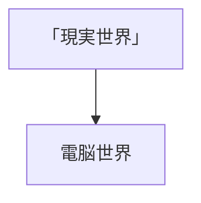
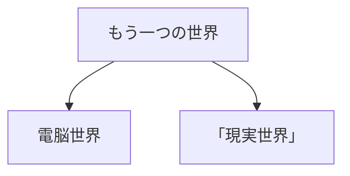

# 世界の構成

## ゲームの前半（スタートから中盤まで）

### 2. 現実世界
ポストアポカリプスの荒廃した世界。主人公はこの世界で目覚め、孤独な日々を過ごしている。
- toDo **エリアを複数用意する**

例）
- **荒廃した都市**: 破壊された建物や廃墟が広がる都市。探索とマテリアル収集の主要エリア。
- **廃墟の村**: 人々が去った後の村。手がかりやマテリアルを見つける場所。
- **自然環境**: 荒れ果てた森や砂漠。サバイバル要素が強いエリア。

### 4. 電脳世界
高度に発展した仮想現実。紫調のサイバー的な雰囲気が特徴的。
- toDo **エリアを複数用意する**
- **（終着点）**: 中盤に差し掛かる頃、主人公は「現実世界」自体がプログラムであることを示す証拠を発見する。
> 記録が残っているとした割には見つけ甲斐のないところな気がする。図書館とか、政府管理所くらい仰々しい場所でいいと思う。
> > 賛成。

例）
- **仮想都市**: ネオンやホログラムが散りばめられた未来的な都市風景。情報収集や謎解きの主要エリア。
- **デジタルオブジェクト**: ハッキングや操作が可能なオブジェクト。プレイヤーの行動に応じて変化する。
- **データストリーム**: 情報や記憶の断片が流れるエリア。探索と情報収集のための場所。

中盤に差し掛かる頃、主人公は「現実世界」自体がプログラムであることを示す証拠を発見する。

## ゲームの後半（中盤から終盤まで）

### 実際の電脳世界の構造
「もう1つの世界」はシミュレーションである電脳世界を複数作成していました。そのうち今回登場するのが「電脳世界」と「現実世界」。

### 2. もう1つの世界
もう1つの世界は、技術が発展したオリジナルのアナログな世界です。災害によって崩壊し、人々は電脳世界へ意識を移した。また、シミュレーションとして機能していた電脳世界の一つである「現実世界」もその一部。
> 崩壊しているならなんで電脳世界とかは動き続けているのかとか気になるし
> > 

### 3. 電脳世界
電脳世界は、もう1つの世界で公的研究機関によって研究目的で作られたシミュレーションの世界。
政府のような公的機関が作成してるため、緊急事態として人々の意識の移動を指示した先が「電脳世界」であり、「もう1つの世界」の崩壊によって意識をこの世界に移しました。よって「電脳世界」には記録が残っている。さらに、アクセスポイントを置くことで個人が作成した電脳世界でもここにアクセスができるようなシステムが実装されている。

### 4. 「現実世界」
「現実世界」は、もう1つの世界で作成された複数のシミュレーション世界のうちの1つ。この世界も同様に崩壊しています。公的な「電脳世界」に対し、「現実世界」は非政府な個人あるいは組織によって作成された世界である。作成した者が「電脳世界」へのアクセスポイントを置いていたことでこの世界から「現実世界」へアクセスできるようになっていた。

## 補足情報
テスト

レイヤー構造の理解
前半の主人公にとって崩壊以前のデータベースを保存しているため「電脳世界」は「現実世界」によって作られた下層の世界という認識だった。しかし、後半では「もう1つの世界」の存在に気づくことで、本来の世界のレイヤー構造が見えてくる。実際は「電脳世界」は「現実世界」ではなくさらに上層に存在した「もう1つの世界」によって作られたものであり、「電脳世界」と「現実世界」は同じ電脳世界である。よってこの2つは同ランクに位置する。
